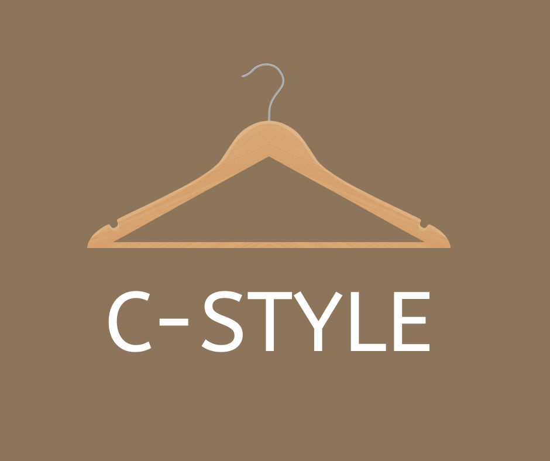

 

<h1 align="center">Welcome To C-STYLE!</h1>

## :information_source: About 
- Your closet is full of multiple clothes, but you never know what to wear ? 
- You lose hours every day messing up everything looking for the right outfit ? 
- Need to pack for a trip but don’t remember what you already have?
<h4 align="center">This app solves the problem! 
With C-STYLE you will be able to easily organize your closet, create outfits with your own clothes and share them with your friends.
</h4> 

- MANAGE YOUR CLOSET: With C-STYLE you can easily add items to your closet by taking a picture or using an existing photo. You can then go through all your clothes and find anything, also by categories and favorites, wherever you are without an internet connection. 
- CREATE OUTFITS: Now that your virtual closet is full, it’s time to create a look. Select items in your closet ,match them together. You always can change and restart as many times you want in a few clicks. In a few seconds you will get a great outfit. Plan what to wear ahead of time by adding your items and outfits to the built-in calendar.

## :link: Menu:

- [Features](https://github.com/dorindorsman/C_Style/blob/master/README.md#space_invader-features) 
- [Screen Gifs](https://github.com/dorindorsman/C_Style/edit/master/README.md#screen-gifs) 
- [Future Plan](https://github.com/dorindorsman/C_Style/edit/master/README.md#future-plan) 
- [Credits](https://github.com/dorindorsman/C_Style/edit/master/README.md#credits) 

## :space_invader: Features

- **Login and Sign-up** with any valid phone number
- Choose your **profile picture**
- Can easily add items to your closet by taking a **picture or using an existing photo in your phone**
- Can easily enter item details: **picture, name, category, size, color, favorite**
- Easily manage your items by **categories**, with our friendly UI.
- Easily manage your favorites items.
- Can easily create outfits by pick items from your storage, with our friendly UI.

## Screen Gifs

|Splash Screen|Login Screen 1|Login Screen 2|Log Out Screen
|--|--|--|--|
|||||

 

|Sign UP Screen 1|Sign UP Screen 2|Profile Screen|
|--|--|--|
|||

 
 
 

|Add Item Screen|Add Item Picture|Fill Item Name|Fill Item Category|
|--|--|--|--|
|||||

 

|Fill Item Size|Fill Item Color|Fill Item Favorite|Save Item|
|--|--|--|--|
|||||

 
 
 

|Add Outfit|Fill Outfit Name|Fill Outfit Items|Save Outfit|
|--|--|--|--|
|||||

## Future Plan 
- Edit profile
- Delete items
- Delete outfits
- Edit items/outfits details
- Share your outfits with friends through a link in other apps

## Credits
 create Logo Icon with https://create.vista.com/home/  
 create gif with https://giphy.com/

